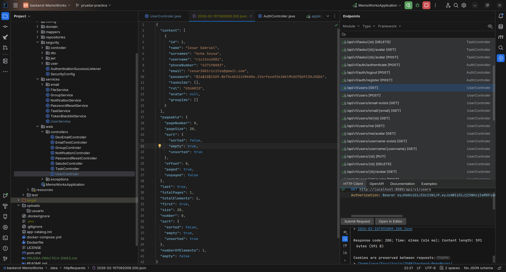
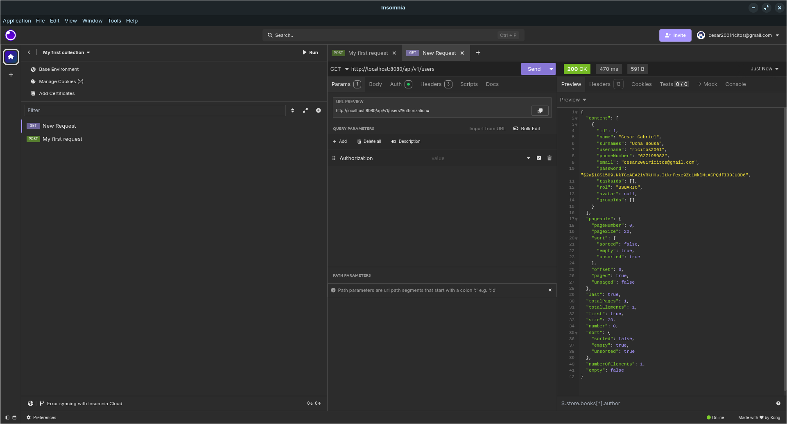

# Prueba practica examen
## Qué endpoint has creado y por qué.
He creado un endpoint llamado `GetTasksByStatus` en `TaskController` que se utiliza para obtener una serie de tareas en funcion de su estado "true o false"
Este endpoint lo decidí crear, ya que me parecía algo simple ademas de que era algo que no habia realizado aun
## Cómo has implementado la seguridad.
He implementado una seguridad de tipo JWT y la he configurado para que no permita ver la información de los endpoints a no ser que uses un token JWT 
## Capturas o comandos para probarlo.
Captura de prueba manual hecha desde el backend:

Captura de prueba manual con imsomnia

Actualmente, solo hay un usuario registrado por lo cual los resultados que aparecen son esperados